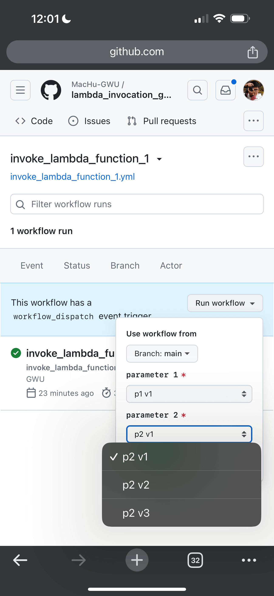

Lambda Invocation GUI
==============================================================================
I need a GUI interface that lets me invoke an AWS Lambda Function remotely from my phone. I don't want to spend time building a custom app. Instead, I am looking for an easy and quick solution. Long ago, I used AWS Lambda Function + API Gateway, then used the `HTTPBOT <https://www.httpbot.io/>`_ IOS app to invoke the API endpoint, hence invoke the AWS Lambda Function. However, it takes some effort to set up the API Gateway and configure the HTTPBOT app.

Recently, I realized that GitHub Actions would be the perfect solution for this problem, even though I have been a GitHub Actions user for 5 years already. `GitHub Action workflow dispatch inputs <https://docs.github.com/en/enterprise-cloud@latest/actions/using-workflows/workflow-syntax-for-github-actions#onworkflow_dispatchinputs>`_ can automatically generate a nice dropdown menu, so I can easily select the options without typing. Also, GitHub is very secure, and I can easily manage the auth token and credentials securely.

Now, let's walk through the final solution.

1. Create an IAM User with an access key pair and give it the least-privilege permissions. In most cases, you only need the ``lambda:InvokeFunction`` permission. Don't forget to set the ``Resources`` as the specific Lambda Function ARN.
2. Store the access key pair as `GitHub secrets <https://docs.github.com/en/actions/security-guides/using-secrets-in-github-actions>`_. Although the `OIDC <https://docs.github.com/en/actions/deployment/security-hardening-your-deployments/configuring-openid-connect-in-cloud-providers>`_ is the recommended authentication model for GitHub Actions + AWS, it needs a lot more setup. We just need a simple solution here, so we will use the access key pair.
3. For each lambda function, create a simple Python script like `invoke_lambda_function1.py <./invoke_lambda_function_1.py>`_ and a simple GitHub Action workflow like `invoke_lambda_function1.yml <./.github/workflows/invoke_lambda_function_1.yml>`_.
4. In the ``.yml`` file, use the `workflow dispatch inputs (see example) <https://github.com/MacHu-GWU/lambda_invocation_gui-project/blob/main/.github/workflows/invoke_lambda_function_1.yml#L7>`_ to enumerate the options for the input parameters. And set them as the `environment variable (see example) <https://github.com/MacHu-GWU/lambda_invocation_gui-project/blob/main/.github/workflows/invoke_lambda_function_1.yml#L29>`_ so that the Python script can access them.
5. In the ``.py`` file, read the environment variables and invoke the AWS Lambda Function with the `boto3 <https://boto3.amazonaws.com/v1/documentation/api/latest/index.html>`_ library.

This is a sample GUI on my phone:

Links:

- `Sample workflow <https://github.com/MacHu-GWU/lambda_invocation_gui-project/actions/workflows/invoke_lambda_function_1.yml>`_
- `Sample workflow definition <./.github/workflows/invoke_lambda_function_1.yml>`_
- `Sample Python script <./invoke_lambda_function_1.py>`_
- `Sample workflow run <https://github.com/MacHu-GWU/lambda_invocation_gui-project/actions/runs/8517079606/job/23327078303>`_
